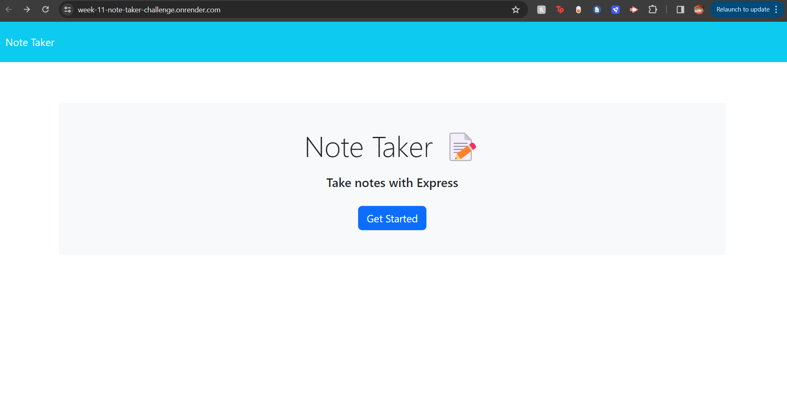

# week-11-note-taker-challenge

## Description
- I wanted to create a note taker application that allows users to create and save notes, read saved notes and delete saved notes.

## Process
- The first thing i did was install the express dependency and the uuid dependency.

- Next i created my server.js file and in that file i imported the express.js framework, the index.js file (which contains my routes). I also included all my middleware. Then i added my get route for the homepage, which serves a static html file at /, my get route for the notes page which serves a different static html file at /notes and my get wildcard get route as my fallback in case of an error (used to catch any requests that dont match any of the defined routes) and this get route serves the home page static index.html file, as that is what the README for this challenge specified. And lastly i ran the server with app.listen().

- Then i created my routes folder, which contained two files, index.js and notes.js. 

- In my index.js file i imported the express framework, the notes.js file which is a module that contains all the routes needed for this application. Then i included the middleware needed to actually use the routes inside the notes.js module at the specified path of /notes. [app.use('/notes', notesRouter)]. And lastly i exported the index.js file as a module.

- Next i created a helper folder which contains a fsUtils.js file which contains the helper functions; readFromFile, writeToFile and readAndAppend.

- In my notes.js file i imported the Router() method on the express framework, to handle and define routes and middleware. Then i imported the readFromFile, writeToFile and readAndAppend form the fsUtils.js module and then the v4 function from the uuid package that i installed earlier,  and renames the v4 funvtion to uuidv4, allowing you to generate UUIDs using uuidv4().
Then i created a GET route for retrieving all of the notes at /. The response is the entire notes database (db.json).
Then i created a GET route for retrieving a specific note from the database based on it's note_id at /:note_id. The response is a json array of the one note object that has the matching note_id.
Then i created a DELETE route for deleting a specific note from the datavase based on its note_id at /:note_id. The response is a json array of all the individual note objects except for the one note object that had the matching note_id.
Then i created a POST request for creating and saving a new note to the database at /. This route ends up overwriting the existign json notes database with an array of all the individual note objects plus the new note object that was just created.

-Lastly i exported the notes module.

## Webpage

- This is the link do my deployed application:
https://week-11-note-taker-challenge.onrender.com

-This is a screenshot of the webpage:

## Repository

- This is a link to my github repo:
https://github.com/Shukrim433/week-11-note-taker-challenge.git